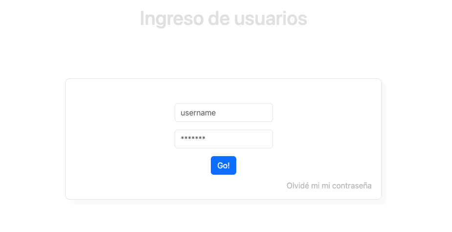
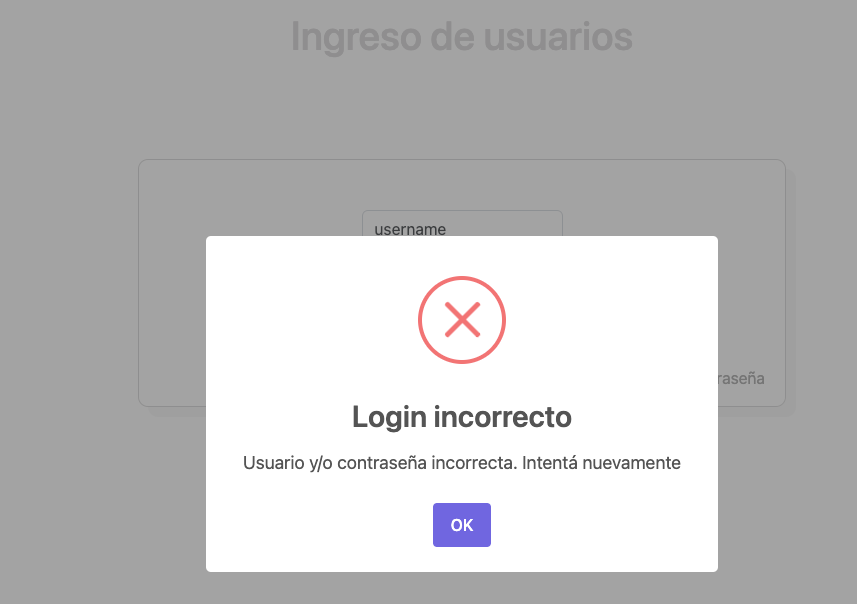
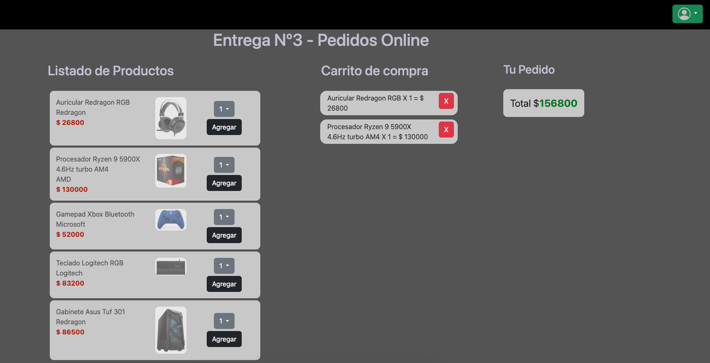
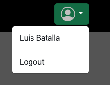
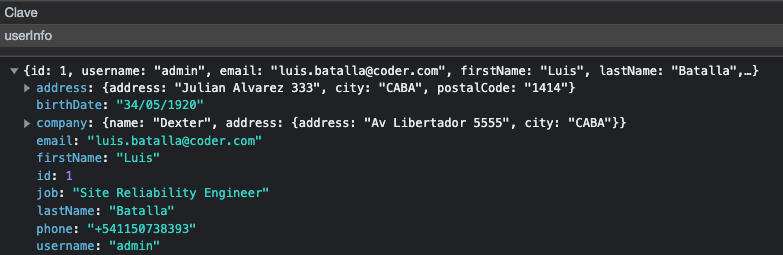

# Practica CoderHouse
    Login: admin
    Password: 12345

## Login
Se implementa interfaz login

## Carrito de Compras
Permite agregar productos a una lista en el carrito y eliminarlas.

Si se agrega un producto existente se acumula y re-calcula el total del carrito.

Se implementó logout de usuario

Se utiliza localStorage para obtener datos del usuario logueado y asi poder hacer luego un logout para eliminarlo del localStorage:

