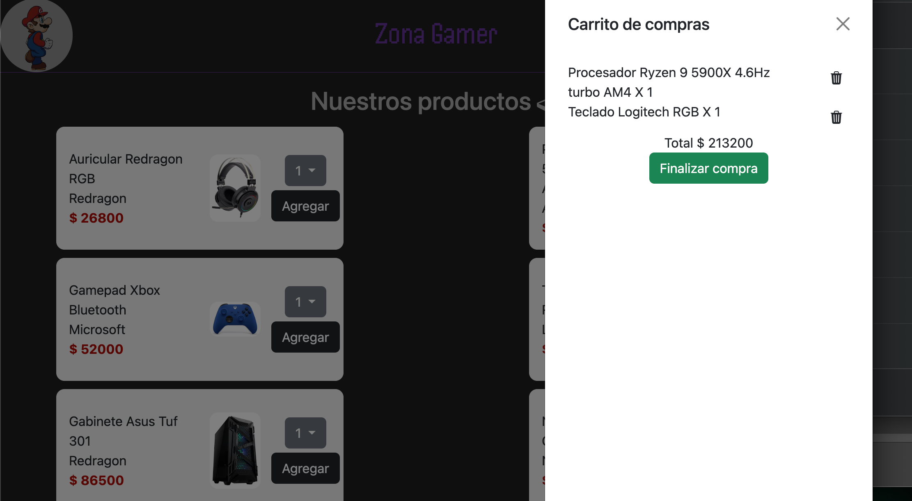

# Practica CoderHouse
    Login: admin
    Password: 12345

    Login2: luis.batalla
    Password: 123456

## Login
Se implementa interfaz login

Se implementó logout de usuario

## Carrito de Compras
Permite agregar productos a una lista en el carrito y eliminarlas.

Si se agrega un producto existente se acumula y re-calcula el total del carrito.

Se utiliza localStorage para obtener datos del usuario logueado y asi poder hacer luego un logout para eliminarlo del localStorage:

Se implementa fetch para obtención:
    * Login
    * productos vía API

## Carrito de compras

## Estilos
Se utilizó el procesador [Sass]("https://sass-lang.com/") para manejo de estilos
